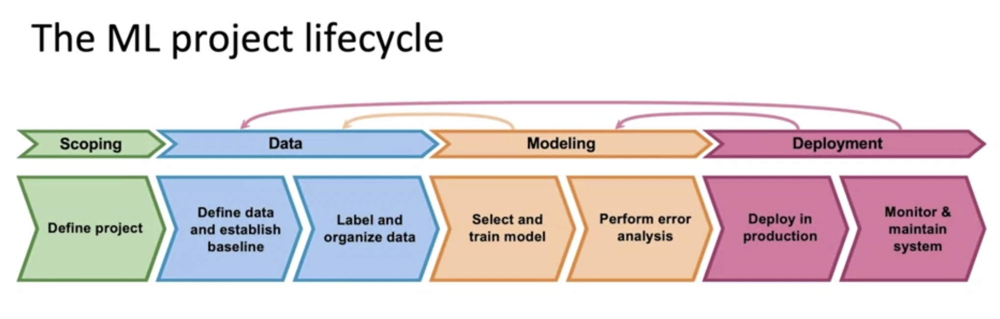
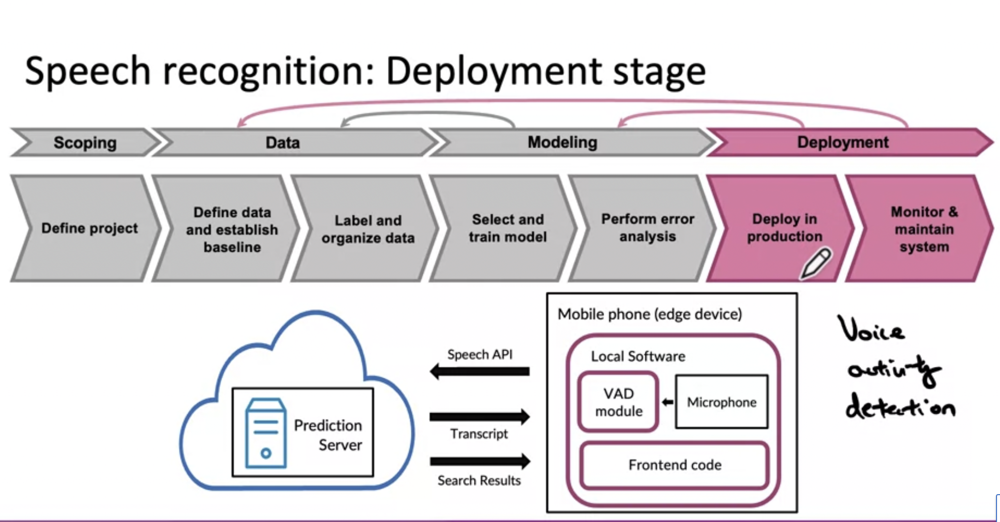

MLOPs
***

**Speach recognision deployment example**

**Scoping**
- Decide to work on speach recognision for voice serach
- Decide on key metrics
    - Accuracy
    - Latency
    - Throughput
- Estimate resources and timeline

**Data**
- Define data
    - Is the data label cosistently?
    - How much silence before/after each clip?
    - how do you perform volume normalization?

**Modeling**
- ML model
    - Code
    - Hyperparameters
    - Data
- Error Analysis 

**Deployment**
- Example deployment framework below 

**Key Challenges in MLOPs**
- Concept drift 
- Data drift 

**Software Engineering Issues**
- Checklist
    - Realtime or Batch?
    - Cloud vs Edge/browser
    - Conpute resources (cpu/gpu/memory)
    - latency, throughput (QPS)
    - logging 
    - Security & privacy 

**Referencees**
- [Concept and Data Drift](https://towardsdatascience.com/machine-learning-in-production-why-you-should-care-about-data-and-concept-drift-d96d0bc907fb)
- [Monitoring ML Models](https://christophergs.com/machine%20learning/2020/03/14/how-to-monitor-machine-learning-models/)
- [A Chat with Andrew on MLOps: From Model-centric to Data-centric](https://www.youtube.com/watch?v=06-AZXmwHjo)

    
